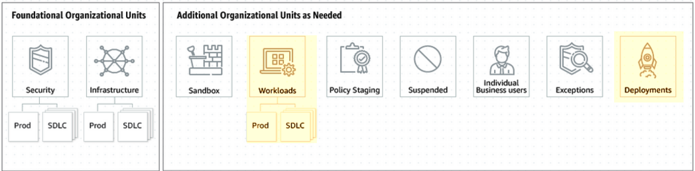

# Terraform CI-CD Playground

## Prerequisites

1. An AWS Organization structure is in place where:

   - There is an organizational unit for workloads with children workload accounts.
   - There is an organizational unit for deployments with a child ci-cd account whose singular function is cross-account deployments

2. A permission set for terraform developers must be provisioned to the Deployments account through IAM Identity Center that provides read-only access to the state files corresponding to the workload accounts they require access to.
